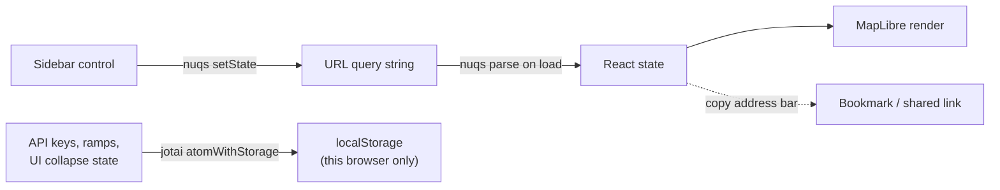

## Using the hosted app

The app is deployed at [terrain-viewer.iconem.com](https://terrain-viewer.iconem.com/) — no install needed. Open it, pick a location, and toggle visualization modes from the sidebar.

A dedicated historical-imagery-only entry point is available at [historical-satellite.iconem.com](https://historical-satellite.iconem.com/) — same app, defaulting straight into Historical mode on a first visit (see [Basemaps & Historical Imagery](/features/basemaps-and-historical)).

## Running locally

```bash
git clone https://github.com/Iconem/terrain-viewer.git
cd terrain-viewer

pnpm install
pnpm run dev      # http://localhost:5173
pnpm run build    # bundles to dist/
```

## The URL as app state

Nearly every sidebar control — viewport (lat/lng/zoom/pitch/bearing), active terrain/basemap sources, every visualization toggle and its options, split-screen layout, historical dates — is mirrored to the URL query string via [nuqs](https://nuqs.dev/docs/basic-usage). That means:

- Copying the address bar URL always reproduces the exact current view for someone else.
- [Bookmarks](/features/bookmarks) are really just a saved query string plus a thumbnail.
- Embedding a specific configuration (e.g. in an iframe) is just linking to the right URL — see [Embedding & URL parameters](/features/embedding) for the full list, a live iframe and a link builder.
- Any view's source can be a URL instead of an id: `?terrainSourceA=https://host/dem.cog.tif`, `?terrainSourceB=…`, `?basemapSource=https://host/ortho.tif`, `?basemapSourceC=https://tiles/{z}/{x}/{y}.png`. A tile template (`{z}`) is read as Terrarium terrain or a TMS basemap, anything else as a COG; `terrainType=` / `basemapType=` override that, `viaTitiler=1` routes COGs through titiler (needed when the file is not in Web Mercator), and a link without its own `lat`/`lng` is framed on view A's COG. The URL is the source's id, so the link is self-contained. The server must allow cross-origin range requests.
- `?drawingUrl=https://host/features.geojson` (repeatable) loads remote vector data into the Drawing tool — see [Tools](/features/tools#drawing).

A minimal iframe, two DEMs side by side with a vector overlay:

```html
<iframe src="https://terrain-viewer.iconem.com/?splitStyle=side-by-side&terrainSourceA=https%3A%2F%2Fhost%2Fbefore.tif&terrainSourceB=https%3A%2F%2Fhost%2Fafter.tif&drawingUrl=https%3A%2F%2Fhost%2Fsites.geojson"></iframe>
```



Not everything is in the URL — API keys, custom color ramps, and collapsed-section preferences live in `localStorage` via `jotai`, since those are per-browser, not part of "the view" someone else would want when opening your link.

See [Tech Stack](/dev/tech-stack) for the libraries this is built on.

## Structure

- `components/TerrainViewer.tsx` (~3,200 lines) — central orchestrator, all state wiring
- `components/TerrainControlPanel/` — the big sidebar, one file per settings section
- `components/LayersAndSources/` — MapLibre layer/source composition
- `lib/` — the real domain logic: one `*-protocol.ts` file per terrain-derivative raster computation, historical-imagery source adapters, export pipelines, `settings-atoms.ts`

## Architecture

- State is split: `nuqs` for shareable URL state (viz toggles, camera, ramps), `jotai` (`atomWithStorage`) for local persistence (API keys, UI collapse state)
- No router — app "modes" are just state, not routes
- No real backend — everything streams from tile/COG providers client-side, with an optional self-hosted `titiler` for export/contours
- Custom MapLibre protocols intercept tile requests to compute derived rasters (some GPU-accelerated) client-side — see below

## Custom protocols

Each of these is a `maplibregl.addProtocol()` registration in `TerrainViewer.tsx`, backed by a `lib/*-protocol.ts` file:

- [Terrain Analysis Rendering Pipeline](/dev/terrain-analysis-pipeline) — Slope, Aspect, Curvature, TRI, TPI, Roughness, Blobness, Sky-View Factor, Openness, Local Dominance: the shared "compute a scalar, smuggle it through raster-dem" mechanism
- [LRM (Local Relief Model)](/dev/lrm) — the one terrain-derivative mode that reads a coarser pyramid ancestor tile instead of a same-zoom neighborhood
- [Lighting Effects](/dev/lighting-effects) — Matcap, Phong, Hard Shadows: real surface normals, GPU shading, and a live-WebGL fast path
- [Equations & Formulas](/dev/equations) — every mode's exact math in one place
- [WMS Float32 DEM Protocol](/dev/wms-float32-protocol) — bridging a plain WMS elevation service into MapLibre's raster-dem pipeline
- [VRT Mosaic Protocol](/dev/vrt-protocol) — reading a GDAL VRT's XML index in the browser, Range-reading the COGs it points at, and reprojecting with proj4

## Historical imagery source adapters

Not custom protocols (ordinary raster/XYZ sources), but the other half of `lib/`'s domain logic:

- [Google Earth Historical Protocol](/dev/ge-historical) — the one exception that IS a custom protocol: a reverse-engineered, self-contained-per-tile Time Machine quadtree
- [ESRI Wayback](/dev/esri-wayback) — a release-chained catalog of full global mosaics, resolved to a date via nearest-real-capture matching
