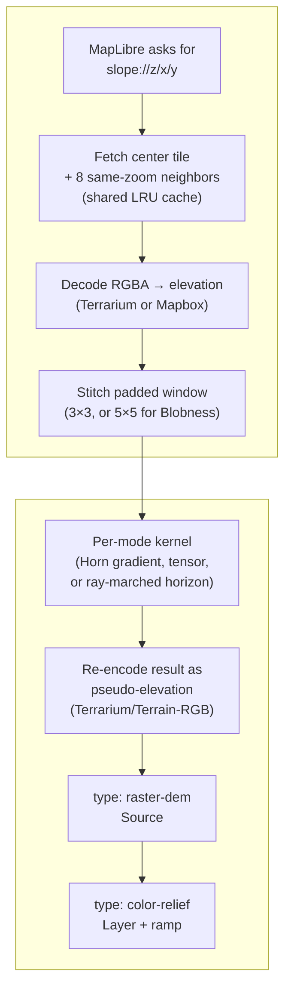

This page covers the mechanism — how a `*-protocol.ts` file gets from an upstream raster-dem tile to a rendered layer. For what each mode *means* geomorphologically, see [Terrain Visualization Modes](/features/visualization-modes); for the exact formulas, see [Equations & Formulas](/dev/equations).

Slope is the reference implementation, but the same pipeline shape covers Aspect, Curvature (and its Profile/Plan/Det-Hessian/Casorati/Shape-Index sub-modes), TRI, TPI, Roughness, Blobness (and its Eigen-Ratio/Orientation sub-modes), Sky-View Factor, Openness, and Local Dominance — eleven modes, three files' worth of shared plumbing, one formula each. LRM and the Lighting Effects modes (Matcap/Phong/Hard Shadows) genuinely diverge — see [LRM](/dev/lrm) and [Lighting Effects](/dev/lighting-effects).


<p className="text-sm text-fd-muted-foreground italic">Slope + Hillshade backdrop — Matterhorn massif — <a href="https://terrain-viewer.iconem.com/?lat=45.9763&lng=7.6586&zoom=12.6&pitch=0&bearing=0&viewMode=3d&showHillshade=true&showTerrainAnalysis=true&showSlope=true&hillshadeOpacity=0.5&slopeMaxDegrees=84&exaggeration=1" target="_blank" rel="noopener noreferrer">open in app ↗</a></p>



## 1. Source fetch

Each mode is a MapLibre [custom protocol](https://maplibre.org/maplibre-gl-js/docs/API/functions/addProtocol/) (`slope://`, `aspect://`, `curvature://`, `tri://`, `tpi://`, `roughness://`, `blobness://`, `svf://`, `openness://`, `local-dominance://`) whose tile URL embeds the *upstream* raster-dem tile template plus `{z}/{x}/{y}`. On a tile request, the handler fetches the center tile **and its 8 same-zoom neighbors** concurrently — needed so the kernel at a tile's edge pixels has real neighbor data rather than a clamped repeat. All of them (and Slope, Aspect, TRI, Curvature, TPI, Roughness, Normals, Matcap, Phong specifically) share one LRU `sharedTileCache`, so turning on several derived layers at once still decodes each upstream tile exactly once.

## 2. Decoding elevation

Each fetched tile's RGBA is decoded to a `Float32Array` using the upstream's encoding — either [Terrarium](https://www.mapzen.com/blog/elevation/) or Mapbox Terrain-RGB (`lib/elevation-encoding.ts`):

$$
h_{\text{terrarium}} = \left(R \cdot 256 + G + \frac{B}{256}\right) - 32768
$$

$$
h_{\text{mapbox}} = -10000 + (R \cdot 256^2 + G \cdot 256 + B) \cdot 0.1
$$

## 3. Stitching a padded neighborhood grid

The 9 decoded tiles are stitched into one padded `(n + 2·halo) × (n + 2·halo)` grid, edge-replicated where a neighbor is missing (world edges, poles, a failed fetch). Most modes use `halo = 1` — a plain 3×3 window (`a0..a8`, GDAL's row-major convention). Blobness uses `halo = 2` (5×5) because its structure tensor needs a Horn gradient computed *at each of the 9 sub-cells* around the output pixel, not just once at the center. SVF/Openness/Local Dominance instead march rays outward up to a user-set search radius (see below), so their halo is that radius, not a fixed 1 or 2.

## 4. The kernel

- **Slope, Aspect, TRI, TPI, Roughness, Curvature** all reuse the same Horn 3×3 gradient (`hornGradient()` in `lib/normal-derived-protocol.ts`, ported from GDAL's `GDALSlopeHornAlg`), Mercator-corrected by `cos(tileCenterLat)` so the ground-distance denominator is real, not the nominal equator-only pixel size.
- **Blobness / Eigen-Ratio / Orientation** build a Förstner/Harris structure tensor from 9 Horn gradients (one per sub-cell of the 3×3 window) and read off `det/trace`, the eigenvalue ratio, or the principal eigenvector's axis.
- **SVF / Openness / Local Dominance** march outward in 8 compass directions (`lib/horizon-angle.ts`) rather than sampling a fixed-size window — see that file's own precision/performance tradeoffs (fixed 8 directions, integer-pixel steps, an optional "fast" power-of-two-radius approximation).

The exact per-mode formulas are on the [Equations page](/dev/equations); this page is about what happens to the result once it's computed.

## 5. Output encoding — the key architectural trick

The computed scalar is **not** rendered directly to RGBA color. It's re-packed as a *pseudo-elevation*, using the exact same byte-packing MapLibre's native `raster-dem` decoder already knows how to read:

```ts
// lib/tri-protocol.ts (representative — every mode in this family ends the same way)
const [r, g, b, alpha] = elevationToTerrarium(computeValue(window))
outData[idx] = r; outData[idx + 1] = g; outData[idx + 2] = b; outData[idx + 3] = alpha
```

Slope uses Mapbox Terrain-RGB packing (base −10000, 0.1 unit step — plenty of precision for a 0–90° angle); every other mode uses Terrarium packing (~0.0039 step) because their values cluster near zero and would visibly band under Terrain-RGB's coarser step. Curvature additionally multiplies by an internal `CURVATURE_ENCODE_SCALE = 1000` before encoding (undone when the raw value is read back for the UI/ramp bounds) purely to spread its small, near-zero-heavy range across more of Terrarium's discrete levels.

Those packed bytes are then handed to maplibre as an **`ImageBitmap`**, via the shared `toTileImage` tail in `lib/tile-image.ts` — *not* PNG-encoded. Every mode on this page used to end with `OffscreenCanvas.convertToBlob({type: "image/png"})`, which was by far the most expensive thing any of them did and entirely wasted, since maplibre decoded the PNG straight back: **99 ms median per 256×256 tile against 0.1 ms** for `createImageBitmap`. The PNG path survives only as a fallback where `createImageBitmap` is unavailable. See [Tile Caches](/dev/tile-caches#handing-tiles-to-maplibre) for the measurements, and maplibre-gl-js [#8515](https://github.com/maplibre/maplibre-gl-js/issues/8515) / [#8525](https://github.com/maplibre/maplibre-gl-js/pull/8525), which documented and typed the return shape after this was found.

The difference in code is two lines, which is exactly why it went unnoticed for so long.

Not recommended:

```ts
const canvas = new OffscreenCanvas(width, height)
canvas.getContext("2d").putImageData(new ImageData(pixels, width, height), 0, 0)
const blob = await canvas.convertToBlob({ type: "image/png" })
return { data: new Uint8Array(await blob.arrayBuffer()) }   // ~99 ms, then maplibre decodes it again
```

Recommended:

```ts
return { data: await createImageBitmap(new ImageData(pixels, width, height)) }   // ~0.1 ms
```

maplibre's own image request already short-circuits on the second form, and always has:

```ts
if (response.data instanceof HTMLImageElement || isImageBitmap(response.data)) {
    // User using addProtocol can directly return HTMLImageElement/ImageBitmap type
    onSuccess(response);
}
```

So the PNG encode existed only to be undone. The types said `ArrayBuffer`, the docs showed a canvas, and the fast path was unadvertised.

## 6. MapLibre consumption

The resulting bitmap is added as an ordinary `type: "raster-dem"` `<Source>` — e.g. `SlopeSource` in `components/LayersAndSources/MapSources.tsx`:

```tsx
<Source id="slopeSource" type="raster-dem" tiles={[url]} tileSize={256} encoding="mapbox" />
```

A `type="color-relief"` `<Layer>` (`SlopeReliefLayer` and its siblings in `MapLayers.tsx`) then reads that source through MapLibre's native `["elevation"]` expression and a `color-relief-color` interpolate expression built from a ramp in `lib/color-ramps.ts` (`slope-plantopo`, `tri-default`, `curvature-diverging`, `blobness-default`, …):

```tsx
<Layer id="color-relief" type="color-relief" source="hillshadeSource" paint={colorReliefPaint} />
```

So: **the derivative value is smuggled through the raster-dem pixel format, and MapLibre's own color-relief machinery does the decode-and-color step.** None of these protocol handlers hand-roll an RGBA colormap themselves — the same `computeColorReliefPaint` helper that colors real hypsometric elevation tint also colors slope degrees, curvature, TRI, and every other mode here, because to MapLibre they're indistinguishable from elevation.

## 7. Registration

Every protocol is registered once, at app init, in `components/TerrainViewer.tsx`:

```ts
maplibregl.addProtocol('slope', withTileResultCache(slopeProtocol))
maplibregl.addProtocol('tri', withTileResultCache(triProtocol))
maplibregl.addProtocol('svf', withTileResultCache(withSlowTileStats('svf', svfProtocol)))
// …one line per mode
```

`withTileResultCache` wraps the raw handler with its own result cache (on top of the shared decoded-tile cache from step 1); `withSlowTileStats` (SVF/Openness/Local Dominance only — the more expensive ray-marched modes) records timing for the app's internal perf instrumentation.

## GPU acceleration — none here

Computation for all eleven modes on this page is pure CPU/JS on the main thread, per tile — nothing here touches a GPU, and `OffscreenCanvas` appears only in the fallback encode path described in step 5, never in the compute. `runWindowedProtocol`/`runNormalDerivedProtocol` explicitly yield every `YIELD_EVERY_ROWS` rows so a burst of new tiles during a pan/zoom doesn't block input handling. For scale: **LRM over a z13 viewport is about 1.2 s of recompute**, which is why finished tiles are cached rather than recomputed on every toggle (see [Tile Caches](/dev/tile-caches)). The only GPU path in the codebase is `computeNormalPixelsGPU` (WebGL2), used exclusively by `lib/normals-protocol.ts` for the surface-normal computation that backs Matcap and Phong — see [Lighting Effects](/dev/lighting-effects).

## Does this apply to Relief Visualization and Lighting too?

- **Sky-View Factor, Openness, Local Dominance** — yes, same output pipeline (step 5 onward). They just replace the fixed 3×3 kernel with the ray-marched horizon-angle core in `lib/horizon-angle.ts` (SVF/Openness) or a pyramid-sampled downward-angle average (Local Dominance, which borrows LRM's ancestor-tile trick for its far field — see [LRM](/dev/lrm)).
- **LRM** — no. It isn't a function of one same-zoom neighborhood at all; it subtracts a coarser pyramid ancestor tile from the fine tile. See the dedicated [LRM](/dev/lrm) page.
- **Matcap, Phong, Hard Shadows** — no. These start from a real `(nx, ny, nz)` surface normal (optionally GPU-computed) rather than a pseudo-elevation scalar, and matcap/phong end as plain `type: "raster"` (not `raster-dem`/color-relief) layers, with an additional live-WebGL fast path that bypasses the protocol round-trip entirely for parameter changes. See [Lighting Effects](/dev/lighting-effects).
