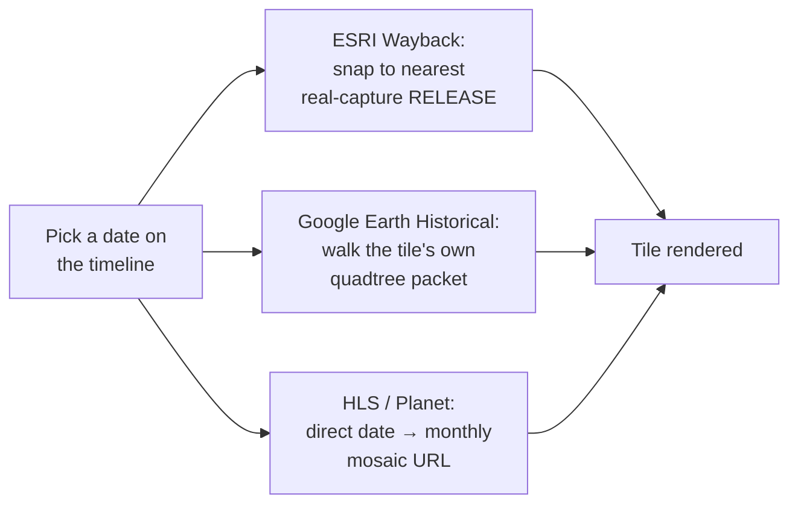

## Basemap sources

The **Basemap** section under Sources offers several satellite/hybrid basemaps ([Google Hybrid](https://mapsplatform.google.com/), [Bing Aerial](https://www.bing.com/maps/aerial), [ESRI World Imagery](https://www.esri.com/en-us/arcgis/products/arcgis-image/services/world-imagery), [Mapbox Satellite](https://www.mapbox.com/), [HERE Satellite](https://www.here.com/), [Google Satellite](https://mapsplatform.google.com/), [OpenStreetMap](https://www.openstreetmap.org/)) plus any custom source you've added — see [Bring Your Own Data](/features/byod).

OpenStreetMap is [OpenFreeMap](https://openfreemap.org/)'s Liberty vector style rather than raster tiles, so it stays crisp at any zoom and can extrude OSM buildings with their recorded heights — the **3D** switch on its row toggles them.

In **split view** (grid layouts up to 4×2 / 8 views, labeled A–H), each basemap row shows an A–H button grid so a different source can be assigned per view. Clicking a row's **label** (not just its A–H buttons) sets *every* active view in the current grid layout to that source in one click — handy for putting a whole 4×2 comparison grid onto Historical Imagery without clicking each pane individually.

Basemap comparison, Side grid mode

## Historical Imagery mode

"Historical Imagery" is a single combined basemap entry covering four underlying providers:

- **[ESRI Wayback](https://livingatlas.arcgis.com/wayback/)** — dated releases of ESRI World Imagery (see the [dev page](/dev/esri-wayback) for how this app resolves a date to a release)
- **[HLS](https://hls.gsfc.nasa.gov/)** (Harmonized Landsat/Sentinel-2) — monthly, coarser resolution
- **[Google Earth Historical](https://github.com/Iconem/GE_TimeMachine)** — occasional very old outlier captures for well-covered areas, via a reverse-engineered `gehist://` protocol scaffolded from Iconem's own GE_TimeMachine (see the [protocol deep dive](/dev/ge-historical) for how it actually works)
- **[Planet Monthly Mosaic](https://www.planet.com/products/basemap/)** — requires an API key

Which one actually renders for a given view/date is chosen via the timeline panel at the bottom of the map, not the sidebar. Each provider gets there differently — see the [dev pages](/dev/ge-historical) for the two most involved.

A 4×2 grid mixing three of the four providers across different capture dates over the same spot (Île de la Cité, Paris) makes the resolution/coverage gap between them obvious at a glance:

Historical Imagery, Split Mode Side (4×2) — ESRI Wayback and Google Earth Historical mixed across capture dates — Île de la Cité, Paris — see <a href="/features/split-modes#side">Split &amp; Compare Modes</a> for how the grid itself works

### The timeline panel

Historical timeline panel — scrubbing capture dates across providers

- Each active view gets a draggable handle on the timeline, positioned at its currently selected capture date.
- Source pills toggle which providers contribute ticks to the shared timeline; resolution-class filters (VHR vs. medium) narrow it further.
- **OSM ELI** (off by default) adds a tick for every dated layer of the OSM Editor Layer Index whose real coverage touches the view: national and city orthophoto series and historical maps (about 1,300 layers carry a capture date, from the 1840s to today). A layer dated by year alone sits at 1 January, one dated by month at the 1st. Picking a tick makes that layer the view's basemap, and the handle stays on it; the tick's tooltip names the layer and its date span. Over Brussels that is 18 layers, the UrbIS orthophotos from 2004 to 2024 among them.
- **Catalogues** (the button after the pills, off by default) is a tree of imagery and old-map catalogues. Every checked catalogue is queried for the view as the camera settles, and its items become ticks in the catalogue's colour; picking a tick makes that item the view's basemap, and the handle stays on it. Each row shows its tick count, a spinner while loading, or "error". The selection is in the URL (`timelineCatalogs`).
  - **OpenAerialMap**, **Maxar Open Data**, **Vantor Open Data**, **NOAA Emergency Response**: the HOT STAC API (`api.imagery.hotosm.org/stac`), searched with the view's bbox. Items of one date and one acquisition are grouped into a tick; the tile shown is the one containing the view's centre, its COG drawn through TiTiler.
  - **Planet disaster data**: Planet's open static STAC catalogue on source.coop (events, pre/post event, acquisitions). It has no search API, so the first use builds an index of every acquisition's extent for the session (about 10 s), then filters it by the view.
  - **Map Warper**: maps rectified on mapwarper.net, searched with the view's bbox; only maps with a year in their depicted date (1400 to today) get a tick, at 1 January.
  - **ArcGIS Online**: public image and map services found by the search API's bbox, sized to the view (an item far larger or smaller than the view is skipped), dated from their title or tags. Each service is checked first: a Web Mercator tile cache draws as tiles, other dynamic services as a 3857 export; a tiles-only service in another projection (the Dutch RD grid, for instance) cannot be drawn and is dropped.
  - **Old Maps Online** is listed greyed: its API has no CORS headers and sits behind a Cloudflare challenge, so a browser cannot query it.
- Any STAC catalogue on the timeline (a custom or library STAC searched by the view and the timeline's window, including catalogues without the queryables extension) is a planned extension of the same mechanism.
- **Zoom**: mouse wheel zooms the timeline in/out around the cursor; a trackpad two-finger swipe pans. The zoom-out limit extends slightly (10% per side) past the oldest/newest real tick, so those extreme marks always have breathing room instead of sitting flush against the track's edge.
- **Pan gutter**: when zoomed in, a small gutter below the track shows where the current window sits within the full range — drag it, or click it, to jump.
- An off-screen handle shows a chevron; clicking it nudges the relevant edge of the view window out to reveal it.

Wayback and Google Earth Historical are the two genuinely different architectures behind that timeline (release-chained catalog vs. self-contained-per-tile protocol); HLS and Planet are both simple monthly-mosaic lookups:

## Dedicated historical-imagery entry point

The app's `appMode` (`terrain` | `historical`) controls whether the full sidebar or a stripped-down historical-imagery-only sidebar is shown — see the in-app Mode Picker (click the sidebar title). It's a shareable/bookmarkable URL param (`?appMode=historical`) like every other setting.

Visiting **historical-satellite.iconem.com** (and any subdomain of it) defaults straight into Historical mode on a first visit, with no query param needed — the main **terrain-viewer.iconem.com** deploy (or any other/unknown domain, a fork, localhost, a preview URL) keeps the normal Terrain default. Once you've explicitly switched modes in your browser on a given domain, that choice is remembered for next time.
