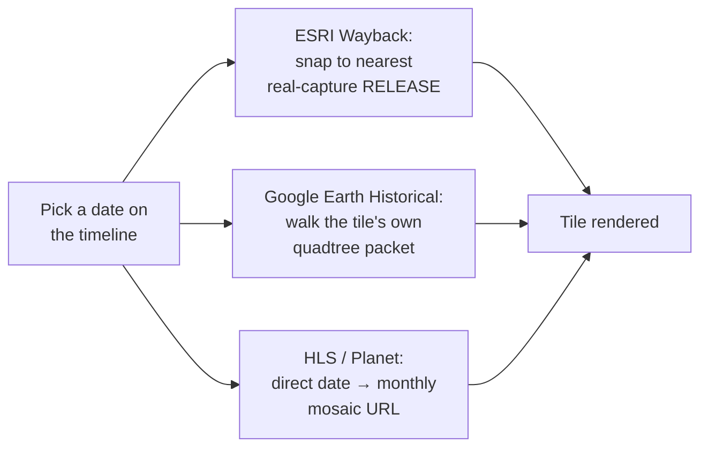

## Basemap sources

The **Basemap** section under Sources offers several satellite/hybrid basemaps ([Google Hybrid](https://mapsplatform.google.com/), [Bing Aerial](https://www.bing.com/maps/aerial), [ESRI World Imagery](https://www.esri.com/en-us/arcgis/products/arcgis-image/services/world-imagery), [Mapbox Satellite](https://www.mapbox.com/), [HERE Satellite](https://www.here.com/), [Google Satellite](https://mapsplatform.google.com/), [OpenStreetMap](https://www.openstreetmap.org/)) plus any custom source you've added — see [Bring Your Own Data](/features/byod).

OpenStreetMap is [OpenFreeMap](https://openfreemap.org/)'s Liberty vector style rather than raster tiles, so it stays crisp at any zoom and can extrude OSM buildings with their recorded heights — the **3D** switch on its row toggles them.

In **split view** (grid layouts up to 4×2 / 8 views, labeled A–H), each basemap row shows an A–H button grid so a different source can be assigned per view. Clicking a row's **label** (not just its A–H buttons) sets *every* active view in the current grid layout to that source in one click — handy for putting a whole 4×2 comparison grid onto Historical Imagery without clicking each pane individually.

Basemap comparison, Side grid mode

### Which services can be added, and which cannot

A browser-only app can draw a tile service when it sends CORS headers, is served over HTTPS, offers Web Mercator (EPSG:3857 tiles, or a WMS answering in EPSG:3857) and needs no secret. Checked 2026-10-05:

**Added** as timeline catalogues (above) or to the basemap library:

| Service | What | Where it is |
|---|---|---|
| [ICGC](https://www.icgc.cat/) | Catalonia orthophotos 1945-2025 | Timeline, National historical |
| [IGN PNOA histórico](https://pnoa.ign.es/) | Spain 1956-2024 | Timeline |
| [Geobasis NRW](https://www.wms.nrw.de/geobasis/wms_nw_hist_dop) | NRW historical DOP 1951-2024 | Timeline |
| [SPW](https://geoportail.wallonie.be/) | Wallonia 1971-2026 | Timeline |
| [Digitaal Vlaanderen](https://www.vlaanderen.be/digitaal-vlaanderen) | Flanders orthophotos and historical maps | Timeline |
| [PDOK Luchtfoto](https://www.pdok.nl/) | Netherlands 2016-2026 | Timeline |
| [Stadt Wien](https://www.wien.gv.at/) | Vienna 1938-2025 | Timeline |
| [geoportail.lu](https://data.public.lu/) | Luxembourg 1967-2025 | Timeline |
| [Hamburg DOP Zeitreihe](https://geoportal-hamburg.de/) | Hamburg 2001-2026 | Timeline |
| [Bayern DOP historisch](https://geodaten.bayern.de/opengeodata/) | Bavaria 2003-2025 | Timeline |
| [Land Tirol](https://www.tirol.gv.at/sicherheit/geoinformation/) | Tyrol 1940-2022 | Timeline |
| [GSI](https://maps.gsi.go.jp/development/ichiran.html) | Japan 1936-1990 | Timeline |
| [NYC](https://maps.nyc.gov/) | New York City 1924-2018 | Timeline |
| [LAiV MV](https://www.laiv-mv.de/Geoinformation/Geobasisdaten/), [LGB Brandenburg](https://geobasis-bb.de/) | 1953 orthophotos | Timeline |
| [NASA GIBS](https://worldview.earthdata.nasa.gov/) | Landsat WELD annual 1983-2000 | Timeline |
| [IGN Géoplateforme](https://remonterletemps.ign.fr/), [swisstopo](https://map.geo.admin.ch/), [Kartverket](https://data.norge.no/en/datasets/41e7c19b-d3c0-37b1-b773-ebb1c852e19a/historiske-kart) | France, Switzerland, Norway | Timeline |
| [Esri World Imagery Clarity](https://www.arcgis.com/home/item.html?id=ab399b847323487dba26809bf11ea91a), [basemap.at](https://basemap.at/), [ČÚZK](https://geoportal.cuzk.cz/), [Geoportal.gov.pl](https://www.geoportal.gov.pl/) | Current HD orthophotos | Basemap library |

The historical OS maps of the [National Library of Scotland](https://maps.nls.uk/) are already in the OSM Editor Layer Index with their dates (about 150 layers), so they come through the ELI catalogue.

**Not addable from a browser**, and why:

| Service | Why |
|---|---|
| [Dataforsyningen](https://dataforsyningen.dk/) (Denmark), [NLS Finland](https://www.maanmittauslaitos.fi/en), [LINZ Basemaps](https://basemaps.linz.govt.nz/) (New Zealand) | A key is required (free). They could join with a key field in Settings, like Planet. |
| [Lantmäteriet historical orthophotos](https://geotorget.lantmateriet.se/) (Sweden), [Norge i bilder](https://norgeibilder.no/) (Norway) | A login or open-data token is required. |
| [Geoportal.gov.pl dated series](https://www.geoportal.gov.pl/) (Poland 1995-2025), [CENIA historical orthophoto](https://micka.cenia.cz/record/full/50210752-9d9c-4f47-956b-1951c0a80137) (Czechia, 1950s) | No Web Mercator (EPSG:2180, 4326 or 5514 only); would need reprojection in the browser. |
| [Geoportale Nazionale](http://www.pcn.minambiente.it/) (Italy) | HTTPS redirects to plain HTTP, which an HTTPS page may not load. |
| [Old Maps Online](https://www.oldmapsonline.org/), [Library of Congress](https://www.loc.gov/maps/), [David Rumsey MapRank](https://www.davidrumsey.com/) | No CORS, Cloudflare challenge; their maps reach the app through Allmaps where georeferenced. |
| [NYPL Map Warper](https://maps.nypl.org/warper) | Archived since 2021. |
| [Mapire](https://mapire.eu/) | Paid WMTS. |
| [Brussels UrbIS](https://datastore.brussels/), [Berlin aerial 1928](https://daten.berlin.de/datensaetze/luftbilder-1928-massstab-1-4-000-wms-bed1a566) | Web Mercator requests fail or come back blank; not resolved. |

## Historical Imagery mode

"Historical Imagery" is a single combined basemap entry covering four underlying providers:

- **[ESRI Wayback](https://livingatlas.arcgis.com/wayback/)** — dated releases of ESRI World Imagery (see the [dev page](/dev/esri-wayback) for how this app resolves a date to a release)
- **[HLS](https://hls.gsfc.nasa.gov/)** (Harmonized Landsat/Sentinel-2) — monthly, coarser resolution
- **[Google Earth Historical](https://github.com/Iconem/GE_TimeMachine)** — occasional very old outlier captures for well-covered areas, via a reverse-engineered `gehist://` protocol scaffolded from Iconem's own GE_TimeMachine (see the [protocol deep dive](/dev/ge-historical) for how it actually works)
- **[Planet Monthly Mosaic](https://www.planet.com/products/basemap/)** — requires an API key

Which one actually renders for a given view/date is chosen via the timeline panel at the bottom of the map, not the sidebar. Each provider gets there differently — see the [dev pages](/dev/ge-historical) for the two most involved.

A 4×2 grid mixing three of the four providers across different capture dates over the same spot (Île de la Cité, Paris) makes the resolution/coverage gap between them obvious at a glance:

Historical Imagery, Split Mode Side (4×2) — ESRI Wayback and Google Earth Historical mixed across capture dates — Île de la Cité, Paris — see <a href="/features/split-modes#side">Split &amp; Compare Modes</a> for how the grid itself works

### The timeline panel

Historical timeline panel — scrubbing capture dates across providers

- Each active view gets a draggable handle on the timeline, positioned at its currently selected capture date.
- Source pills toggle which providers contribute ticks to the shared timeline; resolution-class filters (VHR vs. medium) narrow it further.
- **Catalogues** (the button after the pills, off by default) is a tree of imagery and old-map catalogues. Every checked catalogue is queried for the view as the camera settles, and its items become ticks in the catalogue's colour; picking a tick makes that item the view's basemap, and the handle stays on it. Each row shows its tick count, a spinner while loading, or "error". The selection is in the URL (`timelineCatalogs`).
  - **OSM Editor Layer Index (ELI)** (it was a pill before): a tick for every dated layer of the index whose real coverage touches the view, national and city orthophoto series and historical maps (about 1,300 layers carry a capture date, from the 1840s to today). A layer dated by year alone sits at 1 January, one dated by month at the 1st. Over Brussels that is about 20 layers, the UrbIS orthophotos from 2004 to 2024 among them. An old link with the ELI pill selects it here.
  - **National historical** layers from mapping agencies, ticks only where they cover the view's centre:
    - **IGN Remonter le temps** (France): every dated layer of the Géoplateforme WMTS, read from its capabilities: the 1950-1965, 1965-1980 and 1980-1995 historical aerial mosaics, each yearly orthophoto since 2000 (a year flies about a third of the departments, so a tile at the centre is checked and years without photos there are dropped), SPOT and Pléiades years, Cassini (1756-1815), the État-major maps (1820-1866), the 1950 map, and departmental archives such as Calvados 1947-1991.
    - **swisstopo SWISSIMAGE Zeitreise**: Swiss aerial imagery since 1926, a tick per flight year with imagery at the centre (from geo.admin.ch's identify service).
    - **swisstopo Zeitreise maps**: Dufour, Siegfried and Landeskarte editions of the sheet at the centre since 1844.
    - **Kartverket Amtskart** (Norway): the county maps of 1826-1916.
    - **Regional year series** (`lib/national-historical.ts`), one catalogue each: Catalonia (ICGC, 1945 to 2025), Spain (IGN PNOA histórico: the 1956 American flight, 1973-86, then yearly 2004-2024), North Rhine-Westphalia (1951-2024), Wallonia (SPW, 1971 onwards), Flanders (orthophotos 1971 onwards and the Pourbus, Fricx, Ferraris, Popp and Vandermaelen maps), the Netherlands (PDOK 2016-2026), Vienna (1938 onwards), Luxembourg (1967 onwards), Hamburg (2001-2026, leafless and leafy), Bavaria (2003-2025), Tyrol (1940 onwards), Japan (GSI, 1936-1990), New York City (1924-2018), Mecklenburg-Vorpommern and Brandenburg 1953, and Landsat WELD annual mosaics (1983-2000, 30 m, worldwide). Where the agency publishes a flight index (NRW, Bavaria, Tyrol), one request gives the years flown at the view's centre with their real dates; elsewhere one small tile per year is fetched at the centre and years answering an error, a flat blank or the service's fallback image are dropped.
  - **OpenAerialMap**, **Maxar Open Data**, **Vantor Open Data**, **NOAA Emergency Response**: the HOT STAC API (`api.imagery.hotosm.org/stac`), searched with the view's bbox. Items of one date and one acquisition are grouped into a tick; the tile shown is the one containing the view's centre, its COG drawn through TiTiler.
  - **Planet disaster data**: Planet's open static STAC catalogue on source.coop (events, pre/post event, acquisitions). It has no search API, so the first use builds an index of every acquisition's extent for the session (about 10 s), then filters it by the view.
  - **Map Warper**: maps rectified on mapwarper.net, searched with the view's bbox; only maps with a year in their depicted date (1400 to today) get a tick, at 1 January.
  - **ArcGIS Online**: public image and map services found by the search API's bbox, sized to the view (an item far larger or smaller than the view is skipped), dated from their title or tags. Each service is checked first: a Web Mercator tile cache draws as tiles, other dynamic services as a 3857 export; a tiles-only service in another projection (the Dutch RD grid, for instance) cannot be drawn and is dropped.
  - **Wikimaps Warper**: the same search over maps from Wikimedia Commons georeferenced on warper.wmflabs.org (180 maps over Paris), same year rule.
  - **USGS historical topo maps** (US only): every edition of every USGS topographic quad under the view's centre since 1884, from Esri's historical topo image service, each edition drawn on its own. A tick is dated by the imprint year; photorevised reprints of an older survey say so in their tooltip. The scans keep their white margins.
  - **Old Maps Online** is listed greyed: its API has no CORS headers and sits behind a Cloudflare challenge, so a browser cannot query it. The Georeferencer API, David Rumsey's MapRank and loc.gov are in the same situation; Wikimaps Warper, the USGS service and Allmaps (a coverage overlay) are the browser-friendly alternatives.
- Hovering a tick names it: the source and its date first ("ELI 2020", "OAM 2023-04-18"), then the item ("UrbIS-Ortho 2020"), then its catalogue. The caption under a 2×1 split shows the item's name too.
- Any STAC catalogue on the timeline (a custom or library STAC searched by the view and the timeline's window, including catalogues without the queryables extension) is a planned extension of the same mechanism.
- **Zoom**: mouse wheel zooms the timeline in/out around the cursor; a trackpad two-finger swipe pans. The zoom-out limit extends slightly (10% per side) past the oldest/newest real tick, so those extreme marks always have breathing room instead of sitting flush against the track's edge.
- **Pan gutter**: when zoomed in, a small gutter below the track shows where the current window sits within the full range — drag it, or click it, to jump.
- An off-screen handle shows a chevron; clicking it nudges the relevant edge of the view window out to reveal it.

Wayback and Google Earth Historical are the two genuinely different architectures behind that timeline (release-chained catalog vs. self-contained-per-tile protocol); HLS and Planet are both simple monthly-mosaic lookups:

## Dedicated historical-imagery entry point

The app's `appMode` (`terrain` | `historical`) controls whether the full sidebar or a stripped-down historical-imagery-only sidebar is shown — see the in-app Mode Picker (click the sidebar title). It's a shareable/bookmarkable URL param (`?appMode=historical`) like every other setting.

Visiting **historical-satellite.iconem.com** (and any subdomain of it) defaults straight into Historical mode on a first visit, with no query param needed — the main **terrain-viewer.iconem.com** deploy (or any other/unknown domain, a fork, localhost, a preview URL) keeps the normal Terrain default. Once you've explicitly switched modes in your browser on a given domain, that choice is remembered for next time.
