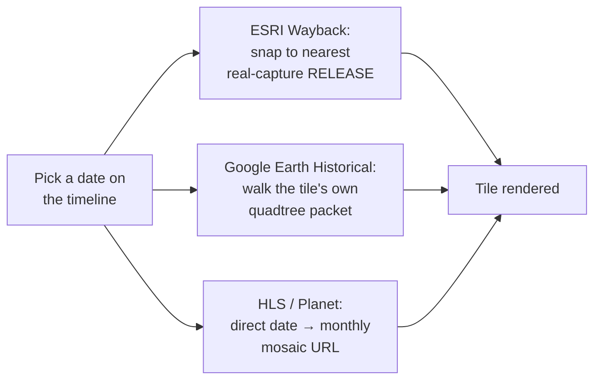

## Basemap sources

The **Basemap** section under Sources offers several satellite/hybrid basemaps ([Google Hybrid](https://mapsplatform.google.com/), [Bing Aerial](https://www.bing.com/maps/aerial), [ESRI World Imagery](https://www.esri.com/en-us/arcgis/products/arcgis-image/services/world-imagery), [Mapbox Satellite](https://www.mapbox.com/), [HERE Satellite](https://www.here.com/), [Google Satellite](https://mapsplatform.google.com/), [OpenStreetMap](https://www.openstreetmap.org/)) plus any custom source you've added — see [Bring Your Own Data](/features/byod).

OpenStreetMap is [OpenFreeMap](https://openfreemap.org/)'s Liberty vector style rather than raster tiles, so it stays crisp at any zoom and can extrude OSM buildings with their recorded heights — the **3D** switch on its row toggles them.

Overlays have an opacity pill each, and the **Overlays** heading one for all of them (`overlaysOpacity`): click a pill and a short vertical slider opens on it, its point for the current value under the pointer, so a drag up or down sets it (bottom 0, top 100).

In **split view** (grid layouts up to 4×2 / 8 views, labeled A–H), each basemap row shows an A–H button grid so a different source can be assigned per view. Clicking a row's **label** (not just its A–H buttons) sets *every* active view in the current grid layout to that source in one click — handy for putting a whole 4×2 comparison grid onto Historical Imagery without clicking each pane individually.

Basemap comparison, Side grid mode

### Which services can be added, and which cannot

A browser-only app can draw a tile service when it sends CORS headers, is served over HTTPS, offers Web Mercator (EPSG:3857 tiles, or a WMS or ArcGIS service answering in EPSG:3857) and needs no secret. Four searches on 2026-10-05 covered the national, regional and city agencies of Europe, North America, Oceania, East Asia and Brazil; every layer below answered an image with CORS for a tile in its area.

**Added** as timeline catalogs (Catalogs → Historical · …), 69 sources and about 1,502 dated layers, plus IGN Remonter le temps, swisstopo and Kartverket (above):

| Area | Sources (years, layers) |
|---|---|
| Asia and Oceania | [Japan (GSI aerial photos)](https://maps.gsi.go.jp/development/ichiran.html) 1936-1990 (7); [New South Wales (historical imagery 1943-2013)](https://www.spatial.nsw.gov.au/) 1943-2013 (35); [Taiwan (NLSC orthophotos 2014-2025)](https://maps.nlsc.gov.tw/) 2014-2025 (12); [Taiwan historical maps (Academia Sinica)](https://gis.sinica.edu.tw/) 1895-2003 (59) |
| Austria | [Salzburg (SAGIS historical orthophotos)](https://www.salzburg.gv.at/themen/salzburg/sagis/luftbildarchiv) 1945-2025 (39); [Styria (orthophotos)](https://www.landesentwicklung.steiermark.at/) 1994-2024 (8); [Tyrol (Land Tirol)](https://www.tirol.gv.at/sicherheit/geoinformation/) 1940-2022 (10); [Vienna (Luftbildpläne)](https://www.wien.gv.at/) 1938-2025 (20); [Vorarlberg (VoGIS aerial photos)](https://vogis.cnv.at/) 1930-2025 (24) |
| Belgium | [Belgium (NGI topographic maps 1860-1994)](https://www.ngi.be/) 1869-1994 (110); [Flanders (Digitaal Vlaanderen)](https://www.vlaanderen.be/digitaal-vlaanderen) 1571-2025 (25); [Wallonia (SPW)](https://geoportail.wallonie.be/) 1971-2026 (19) |
| Central and Eastern Europe | [Cyprus (DLS orthophotos)](https://portal.dls.moi.gov.cy/) 1963-2019 (5); [Lithuania (geoportal.lt orthophotos)](https://www.geoportal.lt/) 1944-2023 (7); [Slovakia (3rd military survey)](https://www.skgeodesy.sk/) 1875-1885 (1); [Slovenia (GURS orthophotos 1990-2025)](https://www.e-prostor.gov.si/) 1990-2025 (32) |
| France | [Auvergne-Rhône-Alpes (CRAIG)](https://www.craig.fr/) 1948-2025 (29); [Strasbourg and Alsace (DataGrandEst)](https://www.datagrandest.fr/) 1750-2022 (31) |
| Germany | [Baden-Württemberg (LGL historical DOP)](https://www.lgl-bw.de/) 1960-2025 (58); [Bavaria (historische DOP)](https://geodaten.bayern.de/opengeodata/) 2003-2025 (23); [Berlin (orthophotos)](https://gdi.berlin.de/) 1953-2026 (18); [Bremen and Bremerhaven (aerial photos)](https://geodienste.bremen.de/) 1937-2025 (40); [Hamburg (DOP Zeitreihe)](https://geoportal-hamburg.de/) 2001-2026 (46); [Lower Saxony (LGLN historical DOP)](https://opendata.lgln.niedersachsen.de/) 2005-2024 (18); [Mecklenburg-Vorpommern and Brandenburg 1953](https://www.laiv-mv.de/Geoinformation/Geobasisdaten/) 1953 (2); [North Rhine-Westphalia (historische DOP)](https://www.bezreg-koeln.nrw.de/geobasis-nrw/produkte-und-dienste/luftbild-und-satellitenbildinformationen/aktuelle-luftbild-und-0) 1951-2024 (73); [Rhineland-Palatinate (historical DOP)](https://lvermgeo.rlp.de/) 1994-2025 (32); [Saxony (GeoSN historical DOP)](https://www.landesvermessung.sachsen.de/historische-luftbilder-digitale-orthophotos-8794.html) 1922-2020 (11) |
| Global | [Landsat WELD annual (NASA GIBS)](https://worldview.earthdata.nasa.gov/) 1983-2000 (9) |
| Italy | [Emilia-Romagna (1976-78)](https://geoportale.regione.emilia-romagna.it/) 1976-1978 (1); [Liguria (1986)](https://geoportal.regione.liguria.it/) 1986 (1); [Lombardy (GAI 1954, 1975)](https://www.geoportale.regione.lombardia.it/) 1954-1975 (2); [Piedmont (orthophotos and IGM maps)](https://www.geoportale.piemonte.it/) 1852-1990 (6); [Sardinia (orthophotos 1940-2019)](https://www.sardegnageoportale.it/) 1940-2019 (13); [South Tyrol (aerial photos and maps)](https://geoservices.buergernetz.bz.it/) 1858-2024 (20); [Tuscany (orthophotos 1954-2013)](https://www.regione.toscana.it/-/geoscopio) 1954-2013 (21) |
| Netherlands and Luxembourg | [Luxembourg (geoportail.lu)](https://data.public.lu/) 1967-2025 (15); [Netherlands (PDOK Luchtfoto)](https://www.pdok.nl/) 2016-2026 (11) |
| North America | [Chatham County, NC (1938-2023)](https://www.chathamcountync.gov/) 1938-2023 (24); [Chicagoland 1938-39 (Field Museum)](https://www.fieldmuseum.org/) 1939 (5); [Connecticut (CT ECO, 1934-2023)](https://cteco.uconn.edu/) 1934-2023 (7); [Florida 1940s (FDEP)](https://floridadep.gov/) 1940-1949 (1); [Iowa (statewide by decade, 1930s-2025)](https://geodata.iowa.gov/) 1930-2025 (10); [King County / Seattle (aerial photos 1936-2025)](https://gis-kingcounty.opendata.arcgis.com/) 1936-2025 (15); [Massachusetts (MassGIS orthophotos)](https://www.mass.gov/orgs/massgis-bureau-of-geographic-information) 1990-2025 (10); [Minnesota (MnGeo, 1938-2025)](https://www.mngeo.state.mn.us/) 1938-2025 (14); [New York City (NYC orthos)](https://maps.nyc.gov/) 1924-2018 (11); [Ottawa (aerial photos 1928-2022)](https://open.ottawa.ca/) 1928-2022 (19); [Toronto (aerial photos 1931-2025)](https://open.toronto.ca/) 1931-2025 (23); [Washington DC (orthophotos and historical maps)](https://opendata.dc.gov/) 1791-2026 (17) |
| South America | [São Paulo (GeoSampa)](https://geosampa.prefeitura.sp.gov.br/) 1930-2020 (5) |
| Spain and Portugal | [Andalusia (1956-57)](https://www.ideandalucia.es/) 1956-1957 (1); [Aragon (1956)](https://icearagon.aragon.es/) 1956 (1); [Asturias (1956, 1970, 1996)](https://www.asturias.es/) 1956-1996 (3); [Balearic Islands (orthophotos 1956-2021)](https://ideib.caib.es/) 1956-2021 (11); [Basque Country (orthophotos 1945-2025)](https://www.geo.euskadi.eus/) 1945-2025 (34); [Canary Islands (1964, 1987)](https://www.grafcan.es/) 1964-1987 (2); [Cantabria (orthophotos 1945-2025)](https://mapas.cantabria.es/) 1945-2025 (16); [Catalonia (ICGC)](https://www.icgc.cat/) 1945-2025 (29); [Galicia (1956-57)](https://mapas.xunta.gal/) 1956-1957 (1); [Madrid region (historical aerial photos)](https://idem.comunidad.madrid/) 1927-2009 (186); [Navarre (orthophotos 1929-2025)](https://idena.navarra.es/) 1929-2025 (30); [Portugal (DGT orthophotos)](https://www.dgterritorio.gov.pt/) 1995-2021 (6); [Spain (IGN PNOA histórico)](https://pnoa.ign.es/) 1956-2024 (26); [Valencian Community (1956-57)](https://icv.gva.es/) 1956-1957 (1) |
| Switzerland | [Basel-Stadt (orthophotos and historical plans)](https://www.geo.bs.ch/) 1615-2023 (46); [Canton of Zürich (orthophotos and maps)](https://www.zh.ch/de/planen-bauen/geoinformation.html) 1843-2025 (24); [City of Zürich (orthophotos 1975-2013)](https://data.stadt-zuerich.ch/) 1975-1995 (5); [Geneva (SITG orthophotos and maps)](https://ge.ch/sitg/) 1932-2024 (26) |

Also added: the [SLUB Virtuelles Kartenforum](https://kartenforum.slub-dresden.de/) (about 9,000 georeferenced old German maps, searched per view like Map Warper), and to the basemap library the current HD orthophotos of [Esri World Imagery Clarity](https://www.arcgis.com/home/item.html?id=ab399b847323487dba26809bf11ea91a), [basemap.at](https://basemap.at/), [ČÚZK](https://geoportal.cuzk.cz/) and [Geoportal.gov.pl](https://www.geoportal.gov.pl/). The historical OS maps of the [National Library of Scotland](https://maps.nls.uk/) are already in the OSM Editor Layer Index with their dates (about 150 layers), so they come through the ELI catalog.

A few services refuse the headless browsers used for testing (Piedmont answers them 401) but serve a normal browser; they are kept.

**Not addable from a browser**, and why:

| Service | Why |
|---|---|
| [Dataforsyningen](https://dataforsyningen.dk/) (Denmark), [NLS Finland](https://www.maanmittauslaitos.fi/en), [LINZ Basemaps](https://basemaps.linz.govt.nz/) (New Zealand) | A key is required (free). They could join with a key field in Settings, like Planet. |
| [Lantmäteriet historical orthophotos](https://geotorget.lantmateriet.se/) (Sweden), [Norge i bilder](https://norgeibilder.no/) (Norway), [Latvia LĢIA](https://www.lgia.gov.lv/) recent cycles, [Ireland MapGenie](https://www.tailte.ie/) (6-inch, 25-inch, 1995+), older [Emilia-Romagna](https://geoportale.regione.emilia-romagna.it/) flights (1954 GAI, 1988, 1994), [PIGMA](https://www.pigma.org/) 1982-83 coast, [Oberösterreich DORIS](https://www.doris.at/) | Login, token or registration required. |
| [Geoportal.gov.pl dated series](https://www.geoportal.gov.pl/) (Poland 1995-2025), [CENIA historical orthophoto](https://micka.cenia.cz/record/full/50210752-9d9c-4f47-956b-1951c0a80137) (Czechia, 1950s), [Maa-amet historical](https://geoportaal.maaamet.ee/) (Estonia: 1993-2025 orthophotos, 1940 maps), [Hessen historical DOP 1952-67](https://gds-srv.hessen.de/), [Schleswig-Holstein historical DOP](https://dienste.gdi-sh.de/), [Kadaster Historische tijdreis](https://www.kadaster.nl/) (Netherlands 1815-2025), [Latvia open orthophotos 1994-99](https://www.lgia.gov.lv/) | No Web Mercator (national grids only, or a cache that cannot be re-projected); would need reprojection in the browser. Estonia and Poland are the most worth it. |
| [Geoportale Nazionale](http://www.pcn.minambiente.it/) (Italy) | HTTPS redirects to plain HTTP, which an HTTPS page may not load. |
| [Croatia DGU](https://geoportal.dgu.hr/), [Greece Ktimatologio](https://www.ktimatologio.gr/) (1945 flight), [Trentino](https://www.provincia.tn.it/), [REDIAM Andalucía](https://www.juntadeandalucia.es/medioambiente/rediam) 1977-83, [Friuli Venezia Giulia](https://irdat.regione.fvg.it/), [Schleswig-Holstein](https://dienste.gdi-sh.de/), [Niederösterreich](https://sdi.noe.gv.at/) | No CORS header (or CORS fixed to another site). |
| [Old Maps Online](https://www.oldmapsonline.org/), [Library of Congress](https://www.loc.gov/maps/), [David Rumsey MapRank](https://www.davidrumsey.com/) | No CORS, Cloudflare challenge; their maps reach the app through Allmaps where georeferenced. |
| [Veneto](https://idt2.regione.veneto.it/), [Iceland LMÍ](https://www.lmi.is/), [Wales DataMapWales](https://datamap.gov.wales/), [Montréal](https://donnees.montreal.ca/), [Hong Kong DOP1000 1963](https://portal.csdi.gov.hk/), [Pennsylvania PennPilot](https://www.pasda.psu.edu/) | Photo footprints, indexes or single frames only, no mosaic to draw. |
| [Thüringen](https://www.geoportal-th.de/), [Kärnten](https://kagis.ktn.gv.at/), [Sachsen-Anhalt](https://www.lvermgeo.sachsen-anhalt.de/de/gdp-luftbildzeitreihen.html), [Castilla y León](https://idecyl.jcyl.es/) | Historical orthophotos are download or viewer only, no public service found. |
| [Romania ANCPI](https://www.ancpi.ro/), [Serbia GeoSrbija](https://geosrbija.rs/) | Unreachable from here (no DNS, refused). |
| [Hungary FÖMI orthophotos](https://www.fentrol.hu/) (OSM.hu mirror) | Works technically, but licensed for OSM editing only. |
| [NYPL Map Warper](https://maps.nypl.org/warper) | Archived since 2021. |
| [Mapire](https://mapire.eu/) | Paid WMTS. |
| [Brussels UrbIS](https://datastore.brussels/), [Berlin aerial 1928](https://daten.berlin.de/datensaetze/luftbilder-1928-massstab-1-4-000-wms-bed1a566), [Wisconsin 1930s](https://www.sco.wisc.edu/), [Tasmania historic aerial](https://www.thelist.tas.gov.au/) | Web Mercator requests fail or come back blank; not resolved. |

## Historical Imagery mode

"Historical Imagery" is a single combined basemap entry covering four underlying providers:

- **[ESRI Wayback](https://livingatlas.arcgis.com/wayback/)** — dated releases of ESRI World Imagery (see the [dev page](/dev/esri-wayback) for how this app resolves a date to a release)
- **[HLS](https://hls.gsfc.nasa.gov/)** (Harmonized Landsat/Sentinel-2) — monthly, coarser resolution
- **[Google Earth Historical](https://github.com/Iconem/GE_TimeMachine)** — occasional very old outlier captures for well-covered areas, via a reverse-engineered `gehist://` protocol scaffolded from Iconem's own GE_TimeMachine (see the [protocol deep dive](/dev/ge-historical) for how it actually works)
- **[Planet Monthly Mosaic](https://www.planet.com/products/basemap/)** — requires an API key

Which one actually renders for a given view/date is chosen via the timeline panel at the bottom of the map, not the sidebar. Each provider gets there differently — see the [dev pages](/dev/ge-historical) for the two most involved.

A 4×2 grid mixing three of the four providers across different capture dates over the same spot (Île de la Cité, Paris) makes the resolution/coverage gap between them obvious at a glance:

Historical Imagery, Split Mode Side (4×2) — ESRI Wayback and Google Earth Historical mixed across capture dates — Île de la Cité, Paris — see <a href="/features/split-modes#side">Split &amp; Compare Modes</a> for how the grid itself works

### The timeline panel

Historical timeline panel — scrubbing capture dates across providers

- Each active view gets a draggable handle on the timeline, positioned at its currently selected capture date.
- Source pills toggle which providers contribute ticks to the shared timeline; resolution-class filters (VHR vs. medium) narrow it further. Every pill can be off (`timelineSources=none`), leaving the catalogs alone on the track.
- **Catalogs** (the button after the pills, off by default) is a tree of imagery and old-map catalogs. Every checked catalog is queried for the view as the camera settles, and its items become ticks in the catalog's colour; picking a tick makes that item the view's basemap, and the handle stays on it. Each row shows its tick count, a spinner while loading, or "error". The selection is in the URL (`timelineCatalogs`).
  - **OSM Editor Layer Index (ELI)** (it was a pill before): a tick for every dated layer of the index whose real coverage touches the view, national and city orthophoto series and historical maps (about 1,300 layers carry a capture date, from the 1840s to today). A layer dated by year alone sits at 1 January, one dated by month at the 1st. Over Brussels that is about 20 layers, the UrbIS orthophotos from 2004 to 2024 among them. An old link with the ELI pill selects it here.
  - **National historical** layers from mapping agencies, ticks only where they cover the view's centre:
    - **IGN Remonter le temps** (France): every dated layer of the Géoplateforme WMTS, read from its capabilities: the 1950-1965, 1965-1980 and 1980-1995 historical aerial mosaics, each yearly orthophoto since 2000 (a year flies about a third of the departments, so a tile at the centre is checked and years without photos there are dropped), SPOT and Pléiades years, Cassini (1756-1815), the État-major maps (1820-1866), the 1950 map, and departmental archives such as Calvados 1947-1991.
    - **swisstopo SWISSIMAGE Zeitreise**: Swiss aerial imagery since 1926, a tick per flight year with imagery at the centre (from geo.admin.ch's identify service).
    - **swisstopo Zeitreise maps**: Dufour, Siegfried and Landeskarte editions of the sheet at the centre since 1844.
    - **Kartverket Amtskart** (Norway): the county maps of 1826-1916.
    - **Regional series** (`lib/national-historical.ts`), one catalog per agency under **Historical · *country*** groups: about seventy national, regional and city archives across Europe, North America, Oceania, East Asia and Brazil, listed below with their years. A group opens by itself when one of its sources covers the view; sources that do not cover it are dimmed. Where the agency publishes a flight index (NRW, Bavaria, Tyrol), one request gives the years flown at the view's centre with their real dates; elsewhere one tile per layer is fetched at the centre, and layers answering an error or a flat blank are dropped. When several years show the very same picture (a map sheet that did not change, or a time service returning the latest flight up to the year asked), only the earliest is kept.
  - **OpenAerialMap**, **Maxar Open Data**, **Vantor Open Data**, **NOAA Emergency Response**: the HOT STAC API (`api.imagery.hotosm.org/stac`), searched with the view's bbox. Items of one date and one acquisition are grouped into a tick; the tile shown is the one containing the view's centre, its COG drawn through TiTiler.
  - **Planet disaster data**: Planet's open static STAC catalog on source.coop (events, pre/post event, acquisitions). It has no search API, so the first use builds an index of every acquisition's extent for the session (about 10 s), then filters it by the view.
  - **Map Warper**: maps rectified on mapwarper.net, searched with the view's bbox; only maps with a year in their depicted date (1400 to today) get a tick, at 1 January.
  - **ArcGIS Online**: public image and map services found by the search API's bbox, sized to the view (an item far larger or smaller than the view is skipped), dated from their title or tags. Each service is checked first: a Web Mercator tile cache draws as tiles, other dynamic services as a 3857 export; a tiles-only service in another projection (the Dutch RD grid, for instance) cannot be drawn and is dropped.
  - **SLUB Kartenforum**: about 9,000 old maps of Germany georeferenced by the SLUB Dresden Virtuelles Kartenforum (Messtischblätter, topographic maps, city plans), searched for the view through its open search index, sized like Map Warper, each dated by its publication year.
  - **Wikimaps Warper**: the same search over maps from Wikimedia Commons georeferenced on warper.wmflabs.org (180 maps over Paris), same year rule.
  - **USGS historical topo maps** (US only): every edition of every USGS topographic quad under the view's centre since 1884, from Esri's historical topo image service, each edition drawn on its own. A tick is dated by the imprint year; photorevised reprints of an older survey say so in their tooltip. The scans keep their white margins.
  - **Old Maps Online** is listed greyed: its API has no CORS headers and sits behind a Cloudflare challenge, so a browser cannot query it. The Georeferencer API, David Rumsey's MapRank and loc.gov are in the same situation; Wikimaps Warper, the USGS service and Allmaps (a coverage overlay) are the browser-friendly alternatives.
- The picker's header has **Fold all / Expand all**, and two switches: **Footprints on the map** draws every item found as a faint outline in its catalog's colour, and **Within the timeline window** asks the catalogs only for items dated inside the timeline's current zoomed window (STAC searches pass it to the server). Picking an item much smaller than the view and wholly inside it frames it on the map. Every item picked joins **Your basemaps** in the coverage tree, with its extent and a zoom-to-fit button.
- Hovering a tick names it: the source and its date first ("ELI 2020", "OAM 2023-04-18"), then the item ("UrbIS-Ortho 2020"), then its catalog. The caption under a 2×1 split shows the item's name too.
- Any STAC catalog on the timeline (a custom or library STAC searched by the view and the timeline's window, including catalogs without the queryables extension) is a planned extension of the same mechanism.
- **Zoom**: mouse wheel zooms the timeline in/out around the cursor; a trackpad two-finger swipe pans. The zoom-out limit extends slightly (10% per side) past the oldest/newest real tick, so those extreme marks always have breathing room instead of sitting flush against the track's edge.
- **Pan gutter**: when zoomed in, a small gutter below the track shows where the current window sits within the full range — drag it, or click it, to jump.
- An off-screen handle shows a chevron; clicking it nudges the relevant edge of the view window out to reveal it.

Wayback and Google Earth Historical are the two genuinely different architectures behind that timeline (release-chained catalog vs. self-contained-per-tile protocol); HLS and Planet are both simple monthly-mosaic lookups:

## Dedicated historical-imagery entry point

The app's `appMode` (`terrain` | `historical`) controls whether the full sidebar or a stripped-down historical-imagery-only sidebar is shown — see the in-app Mode Picker (click the sidebar title). It's a shareable/bookmarkable URL param (`?appMode=historical`) like every other setting.

Visiting **historical-satellite.iconem.com** (and any subdomain of it) defaults straight into Historical mode on a first visit, with no query param needed — the main **terrain-viewer.iconem.com** deploy (or any other/unknown domain, a fork, localhost, a preview URL) keeps the normal Terrain default. Once you've explicitly switched modes in your browser on a given domain, that choice is remembered for next time.
