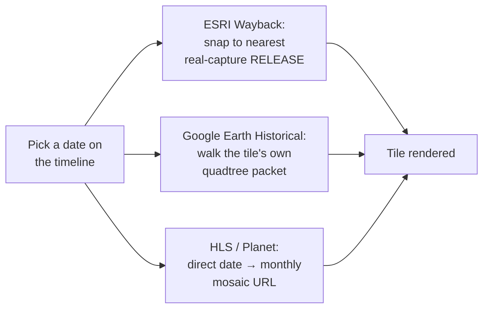

The [historical timeline](/features/historical-imagery#historical-imagery-mode) draws from two kinds of sources: its own providers, turned on and off with the source pills, and the catalogs, checked in the **Catalogs** tree (the same tree as **Basemaps · Historical** in [Sources Coverage](/features/coverage-overlays#the-coverage-tree)). This page lists them all, as the app groups them, with what each holds and where it comes from. How to use the timeline, the picker and a tick's card is on [Historical Imagery Timeline](/features/historical-imagery).

## The timeline's own providers

The sidebar's **Historical Imagery** basemap entry covers these. Which one renders for a view and a date is chosen on the timeline panel at the bottom of the map, not in the sidebar.

| Provider | What it holds | Resolution class |
|---|---|---|
| [ESRI Wayback](https://livingatlas.arcgis.com/wayback/) | Dated releases of ESRI World Imagery. See the [dev page](/dev/esri-wayback) for how a date is resolved to a release. | VHR |
| [Google Earth Historical](https://github.com/Iconem/GE_TimeMachine) | Occasional very old captures for well-covered areas, through a reverse-engineered `gehist://` protocol scaffolded from Iconem's own GE_TimeMachine. See the [protocol deep dive](/dev/ge-historical). | VHR |
| [Bing Aerial](https://www.bing.com/maps/aerial) | No date archive: one live mosaic, which contributes its single current capture date. | VHR |
| [Planet Monthly Mosaic](https://www.planet.com/products/basemap/) | Monthly mosaics. Needs a Planet API key (Settings → API Keys). | Medium |
| [NASA HLS](https://hls.gsfc.nasa.gov/) | Harmonized Landsat and Sentinel-2: monthly, coarser resolution. | Medium |
| [EOX Sentinel-2 Cloudless](https://s2maps.eu/) | Yearly cloud-free Sentinel-2 mosaics (2016, then 2018 to 2025). | Medium |

The resolution pills on the timeline filter by class: unset means **VHR** only; the medium-resolution series (NASA HLS, Sentinel-2, Planet monthly, and the Landsat WELD catalog below) need **Medium res** on.

Wayback and Google Earth Historical are the two genuinely different architectures behind the timeline (release-chained catalog vs. self-contained-per-tile protocol); HLS and Planet are both simple monthly-mosaic lookups:

A 4×2 grid mixing providers across different capture dates over the same spot (Île de la Cité, Paris) makes the resolution and coverage gap between them obvious at a glance:

Historical Imagery, Split Mode Side (4×2) — ESRI Wayback and Google Earth Historical mixed across capture dates — Île de la Cité, Paris — see <a href="/features/split-modes#side">Split &amp; Compare Modes</a> for how the grid itself works

## The Catalogs tree

The catalogs sit in four root groups. Every checked catalog is queried for the view as the camera settles, and its items become ticks in the catalog's colour. The selection is in the URL (`timelineCatalogs`).

### Open data for post-crisis response

| Catalog | What it holds | How it is read |
|---|---|---|
| [OpenAerialMap](https://openaerialmap.org/) | Open drone and aerial imagery uploaded to OpenAerialMap, one tick per upload, dated by its capture. | HOT STAC API |
| [Maxar Open Data](https://www.maxar.com/open-data) | Maxar's pre- and post-event 30-50 cm imagery for disasters (CC BY-NC 4.0), one tick per acquisition. | HOT STAC API |
| [Vantor Open Data](https://www.vantor.com/company/open-data-program) | The Vantor (ex-Maxar) open data programme, 2025 onwards. | HOT STAC API |
| [NOAA Emergency Response](https://storms.ngs.noaa.gov/) | NOAA's aerial imagery after hurricanes, tornadoes and floods. | HOT STAC API |
| [Planet disaster data](https://source.coop/planet/disasterdata) | Planet's Crisis Response Program releases on Source Cooperative: events, pre- and post-event acquisitions. | Static STAC catalog |

The first four come from the HOT STAC API (`api.imagery.hotosm.org/stac`), searched with the view's bbox. Items of one date and one acquisition are grouped into a tick; the tile shown is the one containing the view's centre, its COG drawn through TiTiler. Planet's open static catalog on source.coop has no search API, so the first use builds an index of every acquisition's extent for the session (about 10 s), then filters it by the view. Who produces this data after a disaster is on [Post-Crisis Response](/dev/post-crisis-response).

### Community indexes

- **[OSM Editor Layer Index (ELI)](https://github.com/osmlab/editor-layer-index)** (it was a pill before): a tick for every dated layer of the index whose real coverage touches the view, national and city orthophoto series and historical maps (about 1,300 layers carry a capture date, from the 1840s to today). A layer dated by year alone sits at 1 January, one dated by month at the 1st. Over Brussels that is about 20 layers, the UrbIS orthophotos from 2004 to 2024 among them. An old link with the ELI pill selects it here.
- **[ArcGIS Online](https://www.arcgis.com/)**: public image and map services found by the search API's bbox, sized to the view (an item far larger or smaller than the view is skipped), dated from their title or tags. Each service is checked first: a Web Mercator tile cache draws as tiles, other dynamic services as a 3857 export; a tiles-only service in another projection (the Dutch RD grid, for instance) cannot be drawn and is dropped.
- **[NextGIS QMS](https://qms.nextgis.com/)**: the Quick Map Services whose extent touches the view, as outlines, with no dates (see [Coverage Overlays](/features/coverage-overlays#what-is-offered)).

### Mapping agencies national catalogs

Every archive sits under its continent, then its country with the ISO alpha-3 code. Ticks appear only where a layer covers the view's centre. A group opens by itself when one of its sources covers the view; sources that do not cover it are dimmed.

- **[IGN Remonter le temps](https://geoservices.ign.fr/actualites/2026-02-remonter-le-temps)** (France): every dated layer of the Géoplateforme WMTS, read from its capabilities: the 1950-1965, 1965-1980 and 1980-1995 historical aerial mosaics, each yearly orthophoto since 2000 (a year flies about a third of the departments, so a tile at the centre is checked and years without photos there are dropped), SPOT and Pléiades years, Cassini (1756-1815), the État-major maps (1820-1866), the 1950 map, and departmental archives such as Calvados 1947-1991.
- **[swisstopo SWISSIMAGE Zeitreise](https://map.geo.admin.ch)**: Swiss aerial imagery since 1926, a tick per flight year with imagery at the centre (from geo.admin.ch's identify service).
- **[swisstopo Zeitreise maps](https://map.geo.admin.ch)**: Dufour, Siegfried and Landeskarte editions of the sheet at the centre since 1844.
- **[Kartverket Amtskart](https://www.kartverket.no/)** (Norway): the county maps of 1826-1916, the first regular map series of the country.
- **Regional series** (`lib/national-historical.ts`), one catalog per agency: about seventy national, regional and city archives across Europe, North America, Oceania, East Asia and Brazil, listed below with their years and layer counts. Where the agency publishes a flight index (NRW, Bavaria, Tyrol), one request gives the years flown at the view's centre with their real dates; elsewhere one tile per layer is fetched at the centre, and layers answering an error or a flat blank are dropped. When several years show the very same picture (a map sheet that did not change, or a time service returning the latest flight up to the year asked), only the earliest is kept.

69 sources and about 1,502 dated layers:

| Area | Sources (years, layers) |
|---|---|
| Asia and Oceania | [Japan (GSI aerial photos)](https://maps.gsi.go.jp/development/ichiran.html) 1936-1990 (7); [New South Wales (historical imagery 1943-2013)](https://www.spatial.nsw.gov.au/) 1943-2013 (35); [Taiwan (NLSC orthophotos 2014-2025)](https://maps.nlsc.gov.tw/) 2014-2025 (12); [Taiwan historical maps (Academia Sinica)](https://gis.sinica.edu.tw/) 1895-2003 (59) |
| Austria | [Salzburg (SAGIS historical orthophotos)](https://www.salzburg.gv.at/themen/salzburg/sagis/luftbildarchiv) 1945-2025 (39); [Styria (orthophotos)](https://www.landesentwicklung.steiermark.at/) 1994-2024 (8); [Tyrol (Land Tirol)](https://www.tirol.gv.at/sicherheit/geoinformation/) 1940-2022 (10); [Vienna (Luftbildpläne)](https://www.wien.gv.at/) 1938-2025 (20); [Vorarlberg (VoGIS aerial photos)](https://vogis.cnv.at/) 1930-2025 (24) |
| Belgium | [Belgium (NGI topographic maps 1860-1994)](https://www.ngi.be/) 1869-1994 (110); [Flanders (Digitaal Vlaanderen)](https://www.vlaanderen.be/digitaal-vlaanderen) 1571-2025 (25); [Wallonia (SPW)](https://geoportail.wallonie.be/) 1971-2026 (19) |
| Central and Eastern Europe | [Cyprus (DLS orthophotos)](https://portal.dls.moi.gov.cy/) 1963-2019 (5); [Lithuania (geoportal.lt orthophotos)](https://www.geoportal.lt/) 1944-2023 (7); [Slovakia (3rd military survey)](https://www.skgeodesy.sk/) 1875-1885 (1); [Slovenia (GURS orthophotos 1990-2025)](https://www.e-prostor.gov.si/) 1990-2025 (32) |
| France | [Auvergne-Rhône-Alpes (CRAIG)](https://www.craig.fr/) 1948-2025 (29); [Strasbourg and Alsace (DataGrandEst)](https://www.datagrandest.fr/) 1750-2022 (31) |
| Germany | [Baden-Württemberg (LGL historical DOP)](https://www.lgl-bw.de/) 1960-2025 (58); [Bavaria (historische DOP)](https://geodaten.bayern.de/opengeodata/) 2003-2025 (23); [Berlin (orthophotos)](https://gdi.berlin.de/) 1953-2026 (18); [Bremen and Bremerhaven (aerial photos)](https://geodienste.bremen.de/) 1937-2025 (40); [Hamburg (DOP Zeitreihe)](https://geoportal-hamburg.de/) 2001-2026 (46); [Lower Saxony (LGLN historical DOP)](https://opendata.lgln.niedersachsen.de/) 2005-2024 (18); [Mecklenburg-Vorpommern and Brandenburg 1953](https://www.laiv-mv.de/Geoinformation/Geobasisdaten/) 1953 (2); [North Rhine-Westphalia (historische DOP)](https://www.bezreg-koeln.nrw.de/geobasis-nrw/produkte-und-dienste/luftbild-und-satellitenbildinformationen/aktuelle-luftbild-und-0) 1951-2024 (73); [Rhineland-Palatinate (historical DOP)](https://lvermgeo.rlp.de/) 1994-2025 (32); [Saxony (GeoSN historical DOP)](https://www.landesvermessung.sachsen.de/historische-luftbilder-digitale-orthophotos-8794.html) 1922-2020 (11) |
| Global | [Landsat WELD annual (NASA GIBS)](https://worldview.earthdata.nasa.gov/) 1983-2000 (9) |
| Italy | [Emilia-Romagna (1976-78)](https://geoportale.regione.emilia-romagna.it/) 1976-1978 (1); [Liguria (1986)](https://geoportal.regione.liguria.it/) 1986 (1); [Lombardy (GAI 1954, 1975)](https://www.geoportale.regione.lombardia.it/) 1954-1975 (2); [Piedmont (orthophotos and IGM maps)](https://www.geoportale.piemonte.it/) 1852-1990 (6); [Sardinia (orthophotos 1940-2019)](https://www.sardegnageoportale.it/) 1940-2019 (13); [South Tyrol (aerial photos and maps)](https://geoservices.buergernetz.bz.it/) 1858-2024 (20); [Tuscany (orthophotos 1954-2013)](https://www.regione.toscana.it/-/geoscopio) 1954-2013 (21) |
| Netherlands and Luxembourg | [Luxembourg (geoportail.lu)](https://data.public.lu/) 1967-2025 (15); [Netherlands (PDOK Luchtfoto)](https://www.pdok.nl/) 2016-2026 (11) |
| North America | [Chatham County, NC (1938-2023)](https://www.chathamcountync.gov/) 1938-2023 (24); [Chicagoland 1938-39 (Field Museum)](https://www.fieldmuseum.org/) 1939 (5); [Connecticut (CT ECO, 1934-2023)](https://cteco.uconn.edu/) 1934-2023 (7); [Florida 1940s (FDEP)](https://floridadep.gov/) 1940-1949 (1); [Iowa (statewide by decade, 1930s-2025)](https://geodata.iowa.gov/) 1930-2025 (10); [King County / Seattle (aerial photos 1936-2025)](https://gis-kingcounty.opendata.arcgis.com/) 1936-2025 (15); [Massachusetts (MassGIS orthophotos)](https://www.mass.gov/orgs/massgis-bureau-of-geographic-information) 1990-2025 (10); [Minnesota (MnGeo, 1938-2025)](https://www.mngeo.state.mn.us/) 1938-2025 (14); [New York City (NYC orthos)](https://maps.nyc.gov/) 1924-2018 (11); [Ottawa (aerial photos 1928-2022)](https://open.ottawa.ca/) 1928-2022 (19); [Toronto (aerial photos 1931-2025)](https://open.toronto.ca/) 1931-2025 (23); [Washington DC (orthophotos and historical maps)](https://opendata.dc.gov/) 1791-2026 (17) |
| South America | [São Paulo (GeoSampa)](https://geosampa.prefeitura.sp.gov.br/) 1930-2020 (5) |
| Spain and Portugal | [Andalusia (1956-57)](https://www.ideandalucia.es/) 1956-1957 (1); [Aragon (1956)](https://icearagon.aragon.es/) 1956 (1); [Asturias (1956, 1970, 1996)](https://www.asturias.es/) 1956-1996 (3); [Balearic Islands (orthophotos 1956-2021)](https://ideib.caib.es/) 1956-2021 (11); [Basque Country (orthophotos 1945-2025)](https://www.geo.euskadi.eus/) 1945-2025 (34); [Canary Islands (1964, 1987)](https://www.grafcan.es/) 1964-1987 (2); [Cantabria (orthophotos 1945-2025)](https://mapas.cantabria.es/) 1945-2025 (16); [Catalonia (ICGC)](https://www.icgc.cat/) 1945-2025 (29); [Galicia (1956-57)](https://mapas.xunta.gal/) 1956-1957 (1); [Madrid region (historical aerial photos)](https://idem.comunidad.madrid/) 1927-2009 (186); [Navarre (orthophotos 1929-2025)](https://idena.navarra.es/) 1929-2025 (30); [Portugal (DGT orthophotos)](https://www.dgterritorio.gov.pt/) 1995-2021 (6); [Spain (IGN PNOA histórico)](https://pnoa.ign.es/) 1956-2024 (26); [Valencian Community (1956-57)](https://icv.gva.es/) 1956-1957 (1) |
| Switzerland | [Basel-Stadt (orthophotos and historical plans)](https://www.geo.bs.ch/) 1615-2023 (46); [Canton of Zürich (orthophotos and maps)](https://www.zh.ch/de/planen-bauen/geoinformation.html) 1843-2025 (24); [City of Zürich (orthophotos 1975-2013)](https://data.stadt-zuerich.ch/) 1975-1995 (5); [Geneva (SITG orthophotos and maps)](https://ge.ch/sitg/) 1932-2024 (26) |

### Old maps, digitised and warped

| Catalog | What it holds | Dates |
|---|---|---|
| [Allmaps](https://allmaps.org/) and [David Rumsey Map Collection](https://www.davidrumsey.com/) | Footprint-only rows: the outlines of every georeferenced map in view (see [Coverage Overlays](/features/coverage-overlays#what-is-offered)). | None in the annotations |
| **Allmaps, dated maps in view** | The same Allmaps maps, dated by the archive's own record. A picked map is draped as an overlay by Allmaps' warped layer. | See below |
| [CORONA Atlas](https://corona.cast.uark.edu/) | The 279 georeferenced KH-4 mosaics of the CORONA Atlas of the Middle East (CAST, University of Arkansas), over the Middle East, North Africa and Central Asia, from CAST's GeoServer; the block index is baked in, as CAST's own list sends no CORS header. | 1963-1972 |
| [Map Warper](https://mapwarper.net/) | Maps rectified by volunteers on mapwarper.net, searched with the view's bbox. | Only maps with a year in their depicted date (1400 to today) get a tick, at 1 January |
| [Wikimaps Warper](https://warper.wmflabs.org/) | Maps from Wikimedia Commons georeferenced on warper.wmflabs.org (180 maps over Paris), same search. | Same year rule |
| [SLUB Kartenforum](https://kartenforum.slub-dresden.de/) | About 9,000 old maps of Germany georeferenced by the SLUB Dresden Virtuelles Kartenforum (Messtischblätter, topographic maps, city plans), searched for the view through its open search index, sized like Map Warper. | Publication year |
| [USGS historical topo maps](https://ngmdb.usgs.gov/topoview/) | US only: every edition of every USGS topographic quad under the view's centre since 1884, from Esri's historical topo image service, each edition drawn on its own. The scans keep their white margins. | Imprint year; photorevised reprints of an older survey say so in their tooltip |
| [Old Maps Online](https://www.oldmapsonline.org/) | Klokan's search engine over library map collections. Listed greyed: see [below](#what-can-be-added-and-what-cannot). | |

**Allmaps, dated maps in view**: the Allmaps annotations carry no date of the map itself, only of the georeferencing, which is never used. The catalog reads the archive's own record: the IIIF manifest the map belongs to (BnF's "Date", Rumsey's "Pub Date", a `navDate`; one read per map in view, up to 40, cached, the earliest year named), else a year in the title when it is plainly historical (before 1950). Maps with neither get no tick.

The paper of these scanned maps can be made transparent: see [Remove paper](/features/basemaps#remove-paper).

### My catalogs

Your own STAC catalogs, attached to the tree: a STAC API (one `/search` with the view's bbox per move, the timeline window passed as `datetime` when the filter is on) or a static `catalog.json` tree (crawled a few levels down, collections skipped by their extent, items filtered by bbox and date, cached for the session), optionally narrowed to one collection (an API collection id, or one child of a static tree). The same loader serves the HOT catalogs above. Each item covering the view is a tick: its `visual`, `cog` or `image` asset (else the first GeoTIFF that is not a mask), drawn through TiTiler since most are in UTM; `gsd`, a thumbnail and the licence come along when the item has them.

Three ways in:

- **Add a catalog…**, the last row of the group in the Catalogs picker: a STAC preset (the imagery ones of the [STAC search](/features/basemaps#stac-search)), a catalog saved there, or a pasted URL; then a collection, a name and a short name for the pill. Try the Planet heritage release of the Eyes on Heritage hackathon, `https://data.source.coop/planet/heritage-hackathon-2026/catalog.json` (145 SkySat and PlanetScope scenes over eight sites, 2017 to 2026), narrowed to one site or whole.
- **Add to the timeline** on the STAC search panel, for the catalog and collection being searched.
- **A link**: the catalog's id in `timelineCatalogs` carries its endpoint, kind and collection, so a shared link resolves in a browser that never saved it. The row shows under My catalogs with a Keep button to store it.

The list is this browser's (`customTimelineCatalogs` in local storage); the ✕ on a row removes it. The browser must be allowed to read the catalog (CORS): most STAC APIs and S3- or Source Cooperative-hosted static catalogs are; a refusal shows as an error on the row. Search by name is not offered for these catalogs.

## In the basemap library

Some historical and current archives are basemaps rather than catalogs: the current HD orthophotos of [Esri World Imagery Clarity](https://www.arcgis.com/home/item.html?id=ab399b847323487dba26809bf11ea91a), [basemap.at](https://basemap.at/), [ČÚZK](https://geoportal.cuzk.cz/) and [Geoportal.gov.pl](https://www.geoportal.gov.pl/), and the 1966 and 1969 CORONA satellite photographs of Taiwan georeferenced by Academia Sinica. The historical OS maps of the [National Library of Scotland](https://maps.nls.uk/) are already in the OSM Editor Layer Index with their dates (about 150 layers), so they come through the ELI catalog.

## What each catalog can tell about an item

The tick card and the lists show what exists:

| Catalog | Resolution | Date | Licence | Page | Thumbnail |
|---|---|---|---|---|---|
| OpenAerialMap, Maxar, Vantor, NOAA (HOT STAC) | gsd | yes | collection's | item | yes |
| Planet disaster data | often | yes | CC BY-NC | item | yes |
| SLUB Kartenforum | scale | yes | no | yes | yes |
| Map Warper, Wikimaps Warper | no (no scale field in the API) | year | no | yes | yes |
| USGS historical topo | scale | yes | public domain | generic | no |
| ArcGIS Online | from the tile cache's finest level or the image's pixel size | title year | item's licence text | yes | no |
| OSM Editor Layer Index | from the max zoom (equator) | yes | licence URL | yes | no |
| National and regional archives | parsed from the label where stated; exact flight dates for NRW, Bavaria, Tyrol | yes | per source | source page | no |
| IGN, swisstopo, Kartverket, CORONA | layer-level | yes | yes | source page | no |
| Allmaps, QMS | no | none in the annotations; the **Allmaps, dated maps in view** catalog reads a year from the map's title or its IIIF manifest (one read per undated map in view, up to 40) | no | yes | derivable (IIIF) |

## What can be added, and what cannot

A browser-only app can draw a tile service when it sends CORS headers, is served over HTTPS, offers Web Mercator (EPSG:3857 tiles, or a WMS or ArcGIS service answering in EPSG:3857) and needs no secret. Four searches on 2026-10-05 covered the national, regional and city agencies of Europe, North America, Oceania, East Asia and Brazil; every layer listed under [Mapping agencies national catalogs](#mapping-agencies-national-catalogs) answered an image with CORS for a tile in its area. Those 69 sources (about 1,502 dated layers) were added, plus IGN Remonter le temps, swisstopo and Kartverket, the SLUB Kartenforum and the basemap library entries [above](#in-the-basemap-library).

A few services refuse the headless browsers used for testing (Piedmont answers them 401) but serve a normal browser; they are kept.

**Not addable from a browser**, and why:

| Service | Why |
|---|---|
| [Dataforsyningen](https://dataforsyningen.dk/) (Denmark), [NLS Finland](https://www.maanmittauslaitos.fi/en), [LINZ Basemaps](https://basemaps.linz.govt.nz/) (New Zealand) | A key is required (free). They could join with a key field in Settings, like Planet. |
| [Lantmäteriet historical orthophotos](https://geotorget.lantmateriet.se/) (Sweden), [Norge i bilder](https://norgeibilder.no/) (Norway), [Latvia LĢIA](https://www.lgia.gov.lv/) recent cycles, [Ireland MapGenie](https://www.tailte.ie/) (6-inch, 25-inch, 1995+), older [Emilia-Romagna](https://geoportale.regione.emilia-romagna.it/) flights (1954 GAI, 1988, 1994), [PIGMA](https://www.pigma.org/) 1982-83 coast, [Oberösterreich DORIS](https://www.doris.at/) | Login, token or registration required. |
| [Geoportal.gov.pl dated series](https://www.geoportal.gov.pl/) (Poland 1995-2025), [CENIA historical orthophoto](https://micka.cenia.cz/record/full/50210752-9d9c-4f47-956b-1951c0a80137) (Czechia, 1950s), [Maa-amet historical](https://geoportaal.maaamet.ee/) (Estonia: 1993-2025 orthophotos, 1940 maps), [Hessen historical DOP 1952-67](https://gds-srv.hessen.de/), [Schleswig-Holstein historical DOP](https://dienste.gdi-sh.de/), [Kadaster Historische tijdreis](https://www.kadaster.nl/) (Netherlands 1815-2025), [Latvia open orthophotos 1994-99](https://www.lgia.gov.lv/) | No Web Mercator (national grids only, or a cache that cannot be re-projected); would need reprojection in the browser. Estonia and Poland are the most worth it. |
| [Geoportale Nazionale](http://www.pcn.minambiente.it/) (Italy) | HTTPS redirects to plain HTTP, which an HTTPS page may not load. |
| [Croatia DGU](https://geoportal.dgu.hr/), [Greece Ktimatologio](https://www.ktimatologio.gr/) (1945 flight), [Trentino](https://www.provincia.tn.it/), [REDIAM Andalucía](https://www.juntadeandalucia.es/medioambiente/rediam) 1977-83, [Friuli Venezia Giulia](https://irdat.regione.fvg.it/), [Schleswig-Holstein](https://dienste.gdi-sh.de/), [Niederösterreich](https://sdi.noe.gv.at/) | No CORS header (or CORS fixed to another site). |
| [Old Maps Online](https://www.oldmapsonline.org/), [Library of Congress](https://www.loc.gov/maps/), [David Rumsey MapRank](https://www.davidrumsey.com/) | No CORS, Cloudflare challenge; their maps reach the app through Allmaps where georeferenced. |
| [Veneto](https://idt2.regione.veneto.it/), [Iceland LMÍ](https://www.lmi.is/), [Wales DataMapWales](https://datamap.gov.wales/), [Montréal](https://donnees.montreal.ca/), [Hong Kong DOP1000 1963](https://portal.csdi.gov.hk/), [Pennsylvania PennPilot](https://www.pasda.psu.edu/) | Photo footprints, indexes or single frames only, no mosaic to draw. |
| [Thüringen](https://www.geoportal-th.de/), [Kärnten](https://kagis.ktn.gv.at/), [Sachsen-Anhalt](https://www.lvermgeo.sachsen-anhalt.de/de/gdp-luftbildzeitreihen.html), [Castilla y León](https://idecyl.jcyl.es/) | Historical orthophotos are download or viewer only, no public service found. |
| [Romania ANCPI](https://www.ancpi.ro/), [Serbia GeoSrbija](https://geosrbija.rs/) | Unreachable from here (no DNS, refused). |
| [Hungary FÖMI orthophotos](https://www.fentrol.hu/) (OSM.hu mirror) | Works technically, but licensed for OSM editing only. |
| [NYPL Map Warper](https://maps.nypl.org/warper) | Archived since 2021. |
| [Mapire](https://mapire.eu/) | Paid WMTS. |
| [Brussels UrbIS](https://datastore.brussels/), [Berlin aerial 1928](https://daten.berlin.de/datensaetze/luftbilder-1928-massstab-1-4-000-wms-bed1a566), [Wisconsin 1930s](https://www.sco.wisc.edu/), [Tasmania historic aerial](https://www.thelist.tas.gov.au/) | Web Mercator requests fail or come back blank; not resolved. |

**Old Maps Online** is listed greyed in the Catalogs tree: its API has no CORS headers and sits behind a Cloudflare challenge, so a browser cannot query it. The Georeferencer API, David Rumsey's MapRank and loc.gov are in the same situation; Wikimaps Warper, the USGS service and Allmaps (a coverage overlay) are the browser-friendly alternatives.

**Not in any catalog yet**, and worth knowing for Paris: the **Inspection Générale des Carrières** keeps the atlas of the former quarries under Paris and the inner suburbs (458 sheets at 1:1,000, begun in 1859) and a geological atlas at 1:5,000; the sheets are viewable on the [City of Paris' pages](https://www.paris.fr/pages/tout-savoir-sur-les-sous-sols-2317) and on an [interactive ArcGIS map](https://s-pass.org/fr/mediatheque/68226/carte-interactive-des-carrieres-parisiennes-igc.html), the BnF holds the [printed atlas](https://catalogue.bnf.fr/ark:/12148/cb40851281h). None of it is served as tiles or as a georeferenced IIIF manifest, so it cannot be draped here; a scan of a sheet goes on the map through Tools → Georeference Image.

**Planned**: any STAC catalog on the timeline (a custom or library STAC searched by the view and the timeline's window, including catalogs without the queryables extension) is a planned extension of the same mechanism.

### Contributing them to the OSM Editor Layer Index

`node docs/scripts/build-eli-contribution.mjs` writes one ELI source file per dated layer into `docs/public/eli-contribution/`, sorted by what the licence allows: *ready* (CC0, public domain, DL-DE Zero), *waiver* (CC BY and the like: ELI lists them once the publisher has signed the OSMF attribution waiver) and *ask* (a licence of the publisher's own). ArcGIS export services and time-parameter WMS are skipped, since ELI has no template for them. Nothing is sent: the files are what a pull request would carry, after the licence step and a check against ELI's existing entries.
