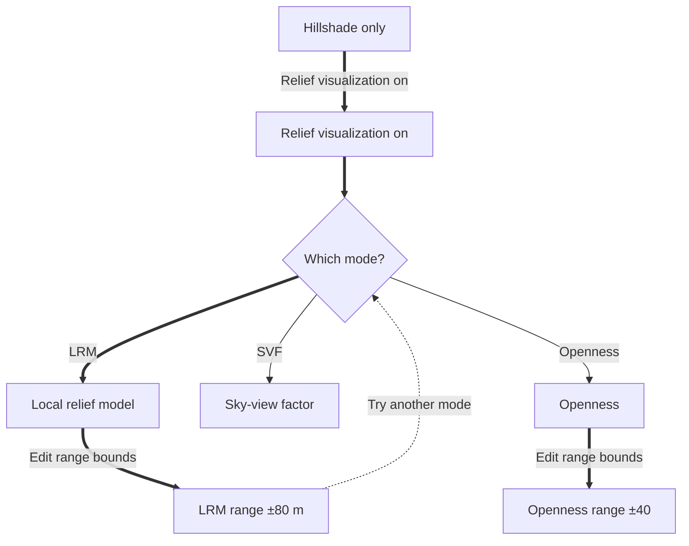

# F2 · Relief visualization modes

Intro: A reviewer switches Relief Visualization on and picks one of its sub-modes. LRM and Openness have an editable range; SVF is shown with its defaults.

```mermaid
flowchart TD
  rv_hillshade[Hillshade only] ==>|Relief visualization on| rv_on[Relief visualization on]
  rv_on ==> mode{Which mode?}
  mode ==>|LRM| rv_lrm[Local relief model]
  mode -->|SVF| rv_svf[Sky-view factor]
  mode -->|Openness| rv_openness[Openness]
  rv_lrm ==>|Edit range bounds| rv_lrm_bounds[LRM range ±80 m]
  rv_openness ==>|Edit range bounds| rv_openness_bounds[Openness range ±40]
  rv_lrm_bounds -.->|Try another mode| mode
```
